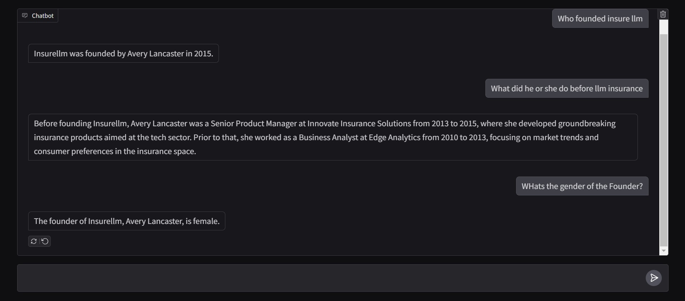

# Building a RAG Chatbot for a Fake Insurance Company

This repository demonstrates the creation of a **Retrieval-Augmented Generation (RAG)** system for a fictional insurance company. The project simulates real-world applications of RAG by using synthetic data and leveraging state-of-the-art AI techniques.

---

## Features

- **Synthetic Insurance Data**: Includes records about the company's founder, employees, products, and operations.
- **Knowledge Base**: Contains structured records about the company, contracts, employees, and products.
- **RAG Pipeline**: Combines information retrieval and generative AI for enhanced question answering.
- **Data Loading and Processing**:
  - Knowledge base is loaded using LangChain's `DirectoryLoader` and `TextLoader` classes.
  - Records are split using the `RecursiveCharacterSplitter`.
- **Embedding and Storage**:
  - Data is embedded using OpenAI models.
  - Embedded data is stored in two vector databases (`Chroma` and `FAISS`) simultaneously and we use them as retrievers.
- **Recursive Chain**: A recursive chain is built to traverse the knowledge base, retrieve relevant information, and supply it to the LLM for generating accurate answers.
- **Interactive Chatbot**: Gradio is used to build an interactive chatbot interface for querying the system.

---

## Contents

- `Knowledge-base/`: Synthetic records about the fictional insurance company.
- `notebooks/`: Jupyter notebooks for building and testing the RAG pipeline, with detailed explanations of:
  - Theoretical background of RAG.
  - Architectural design of the RAG pipeline.
  - Functioning of vector databases.
  - Role and implementation of embeddings.
- `src/`: Source code for retrieval, generation, and system integration.
- `README.md`: Overview and setup instructions.
- `requirements.txt`: List of required Python packages.

---

## Getting Started

### Prerequisites

- Python 3.8 or higher
- Recommended: Virtual environment for package management

### Running the Project

1. Prepare the data by placing or generating synthetic records in the `knowldege-base/` folder.
2. Execute the Jupyter notebook in the `notebooks/` folder to build and test the RAG pipeline.
3. Launch the Gradio-based chatbot interface.

## Usage

1. Load the synthetic data into the RAG pipeline.
2. Input queries related to the fictional company (e.g., "What products does the company offer?").
3. Receive AI-generated responses based on retrieval and generation.
4. Use the chatbot interface for interactive querying and responses.

